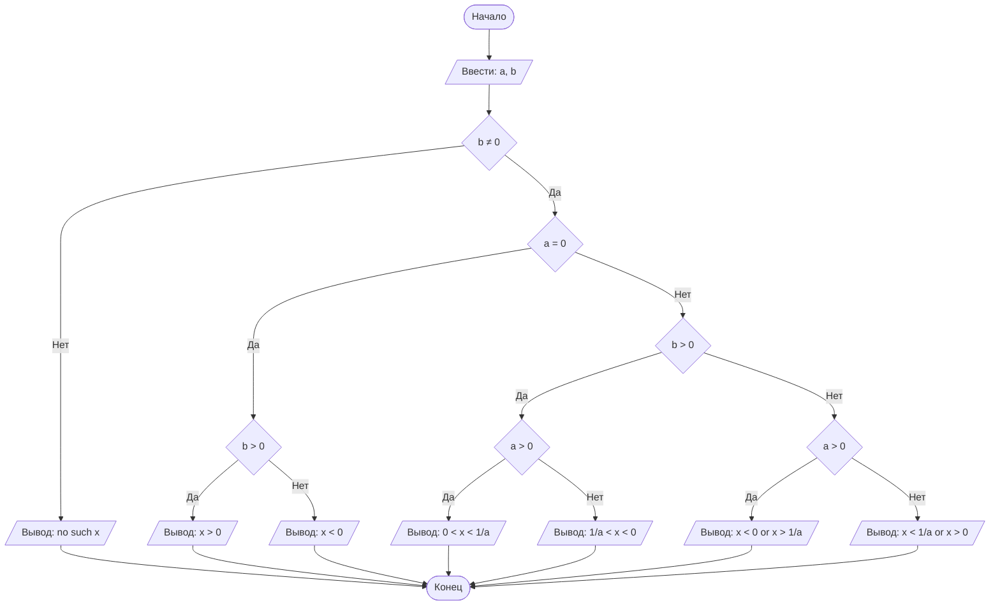

## Отчет по лабораторной работе № 1

#### № группы: `ПМ-2501`

#### Выполнил: `Ушаков Фёдор Денисович`

#### Вариант: `30`

### Cодержание:

- [Постановка задачи](#1-постановка-задачи)
- [Входные и выходные данные](#2-входные-и-выходные-данные)
- [Выбор структуры данных](#3-выбор-структуры-данных)
- [Алгоритм](#4-алгоритм)
- [Программа](#5-программа)
- [Анализ правильности решения](#6-анализ-правильности-решения)

### 1. Постановка задачи

> Программа получает на вход 2 числа (параметра) a и b. Нужно решить неравенство $\frac{xa-1}{bx}<0$ для x и вывести его значение

Данную задачу можно разделить на 2 подзадачи: нахождение и разбиение неравенства на случаи, зависящие от знаков a и b, а также решение этих случаев.

- Для 1 подзадачи нужно рассмотреть 7 случаев:
    1. `b = 0`(тогда просто пустое множество)
    2. `a = 0 и b > 0`
    3. `a = 0 и b < 0`
    4. `a > 0 и b > 0`
    5. `a < 0 и b > 0`
    6. `a > 0 и b < 0`
    7. `a < 0 и b < 0`
- В случае 1 нам не важно значение a, т.к. в при b = 0 всегда получится пустое множество

### 2. Входные и выходные данные

#### Данные на вход

На вход программа должна получать 2 числа, при этом в условии не сказано, к какому множеству
принадлежать получаемые числа, поэтому будем считать их вещественными. При этом нам не указаны их границы.

#### Данные на выход

Т.к. мы должны получить решение неравенства, то будем выводить строки, в которых будем описывать промежутки.

### 3. Выбор структуры данных

Программа получает 2 вещественных числа. Поэтому для их хранения
можно выделить 2 переменных (`a` и `b`) типа `double`.

|             | название переменной | Тип (в Java) | 
|-------------|---------------------|--------------|
| a (Число 1) | `a`                 | `double`     |
| b (Число 2) | `b`                 | `double`     | 

Для вывода результата необязательно его хранить в отдельной переменной.

### 4. Алгоритм

#### Алгоритм выполнения программы:

1. **Ввод данных:**  
   Программа считывает два вещественных числа, обозначенные как `a` и `b`.

2. **Вычисление 1/a**  
   Программа проверяет, а = 0 или нет и в последнем случае вычисляет переменную a1 = 1/a 

3. **Проверка равенства b и 0:**
    - Если b = 0, то мы получаем случай 1 и программа завершается.
    - Если b ≠ 0, то мы сравниваем a с нулем.
        - Если a = 0, то мы проверяем b > 0 и b < 0, получая случаи 2 и 3.
        - Если a ≠ 0, то мы  проверяем b > 0 или b < 0.
            - Если b > 0, то мы проверяем a > 0 или a < 0, получая случаи 4 и 5.
            - Если b < 0, то мы тоже проверяем a > 0 или a < 0, получая случаи 6 и 7.

4. **Вывод результата:**  
   На экран выводится строка, в которой описан промежуток, зависящий от случая.

#### Блок-схема



### 5. Программа

```java
import java.io.PrintStream;
import java.util.Scanner;
public class Main {
    public static Scanner in = new Scanner(System.in);
    public static PrintStream out = System.out;
    public static void main(String[] args) {
        double a = in.nextDouble();
        double b = in.nextDouble();
        double a1 = 0;
        if(a != 0){
            a1 = 1/a;
        }
        if(b != 0){
            if(a == 0){
                if(b>0){
                    out.println("x>0");
                }
                else{
                    out.println("x<0");
                }
            }
            else{
                if(b>0){
                    if(a>0){
                        out.printf("0<x<%.3f", a1);
                    }
                    else{
                        if(a<0){
                            out.printf("%.3f<x<0", a1);
                        }
                    }
                }
                else{
                    if(b<0){
                        if(a>0){
                            out.printf("x<0 or x>%.3f", a1);
                        }
                        else{
                            out.printf("x<%.3f or x>0", a1);
                        }
                    }
                }
            }
        }
        else{
            out.println("no such x");
        }
    }
}
```

### 6. Анализ правильности решения

Программа работает корректно на всем множестве решений с учетом ограничений.

1. Тест на `b != 0`:

    - **Input**:
        ```
        7 0
        ```

    - **Output**:
        ```
        no such x
        ```

2. Тест на `a = 0` и `b > 0`:

    - **Input**:
        ```
        0 3.2
        ```

    - **Output**:
        ```
        x>0
        ```

3. Тест на `a = 0` и `b < 0`:

    - **Input**:
        ```
        0 -5.2
        ```

    - **Output**:
        ```
        x<0
        ```

4. Тест на `a > 0` и `b > 0`:

    - **Input**:
        ```
        5.2 11.7
        ```

    - **Output**:
        ```
        0<x<0.192
        ```

5. Тест на `a < 0` и `b > 0`:

    - **Input**:
        ```
        -3.4 20.6
        ```

    - **Output**:
        ```
        -0.294<x<0
        ```

6. Тест на `a > 0` и `b < 0`:

    - **Input**:
        ```
        10.5 -6.1
        ```

    - **Output**:
        ```
        x<0 or x>0.095
        ```

7. Тест на `a < 0` и `b < 0`:

    - **Input**:
        ```
        -8.45 -7.94
        ```

    - **Output**:
        ```
        x<-0.118 or x>0
        ```
